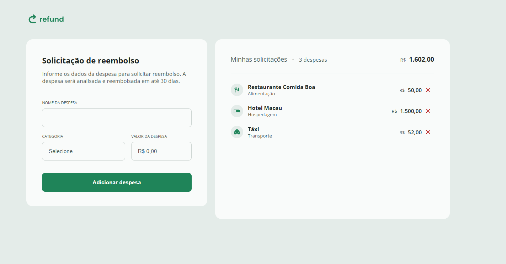

# 💸 Refund Request

Aplicação web para **solicitação de reembolso de despesas de viagem**. Permite registrar gastos, categorizá-los e acompanhar o total solicitado de forma simples e visual.

## 📷 Preview



## ✨ Funcionalidades

-  Adicionar uma nova despesa informando nome, categoria e valor
-  Formatação automática do valor digitado para o padrão monetário brasileiro (R$)
-  Categorização das despesas (alimentação, hospedagem, transporte, serviços, outros)
-  Listagem das despesas cadastradas com ícone correspondente à categoria
-  Remoção individual de despesas da lista
-  Cálculo automático da quantidade e do total das despesas
-  Tratamento de erros com alertas amigáveis ao usuário

## 🛠️ Tecnologias utilizadas

- **HTML5**
- **CSS3**
- **JavaScript** (Vanilla JS, sem frameworks ou bibliotecas)

## 📁 Estrutura do projeto

```
REFUND-REQUEST/
├── css/
│   └── styles.css
├── img/
│   ├── accommodation.svg
│   ├── chevron-down.svg
│   ├── food.svg
│   ├── logo.svg
│   ├── others.svg
│   ├── remove.svg
│   ├── screenshot.png
│   ├── services.svg
│   └── transport.svg
├── js/
│   └── script.js
└── index.html
```

## 🚀 Como executar

1. Clone o repositório:
   ```bash
   git clone <https://github.com/LucasAlmeidaMG/Refund-Request.git>
   ```
2. Acesse a pasta do projeto:
   ```bash
   cd Refund-Request-Project
   ```
3. Abra o arquivo `index.html` no seu navegador de preferência (ou utilize uma extensão como o **Live Server** no VS Code).

## 🧠 Como funciona

O formulário captura o **nome da despesa**, a **categoria** e o **valor** informado. Ao ser enviado:

1. O valor digitado é formatado automaticamente em Real (R$) conforme o usuário digita.
2. Um novo item é criado dinamicamente e adicionado à lista de despesas, exibindo o ícone da categoria escolhida.
3. O total de despesas e a quantidade de itens são recalculados automaticamente a cada inclusão ou remoção.
4. É possível remover qualquer despesa da lista clicando no ícone de remoção, o que atualiza o total instantaneamente.


